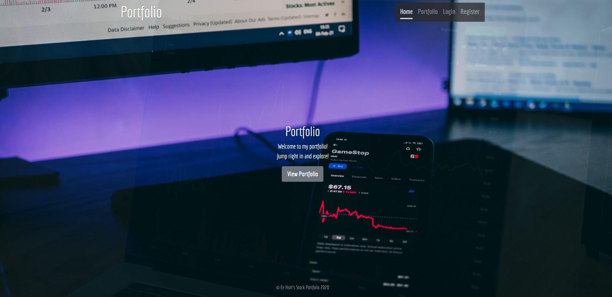
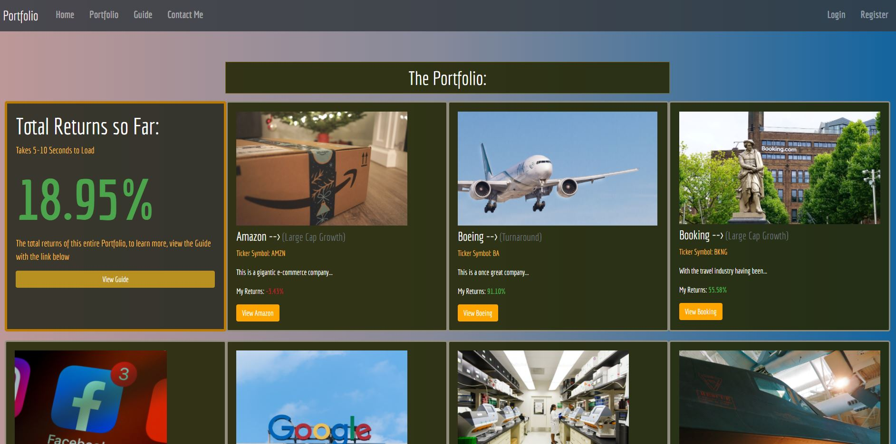
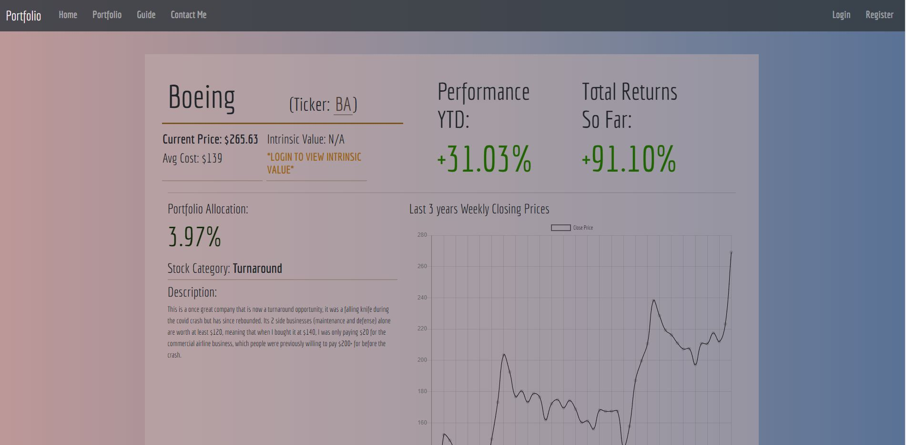
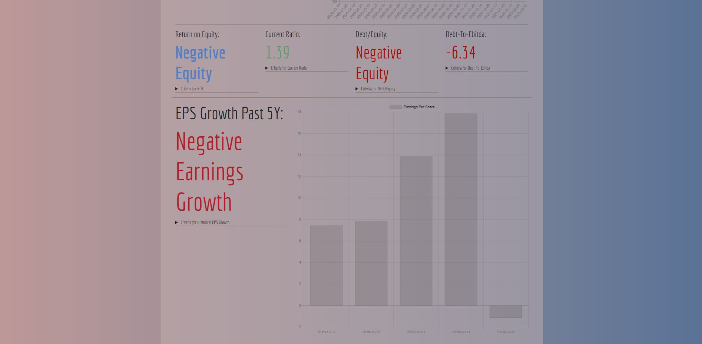
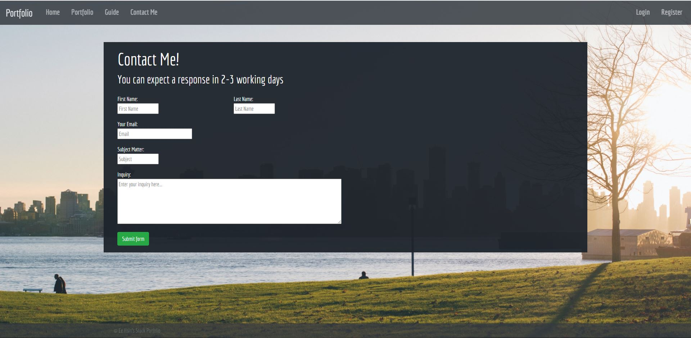

Created a stock portfolio website to showcase the stocks in my portfolio and to track their performance. 
Intrinsic values are hidden to non-registered users, I made it so that users have to register so that I could practice using sessions and working with Passport for authentication.

Note: DO not register with a real password, while my app does have security features in place, it is running on a free Heroku Dyno with no SSL certificate.

Note 1: It's running on a free Heroku Dyno so it may take some time to load initially if the app has been sleeping for a while, but it will work fine once the app is initially loaded and awake.

Note 2: Speed of the API to obtain current prices and current returns will be slower when the market is open due to higher loads on the third party APIS. Markets are open on Weekdays from 9:30am EST to 4:00pm EST. 

You can access the website at https://ee-hsins-stock-portfolio.herokuapp.com/ 

Here are some screenshots dated 16th March 2021:

The home page:

The portfolio Index page:

The individual stock page:

The individual stock's financial section page:

The contact me page:

